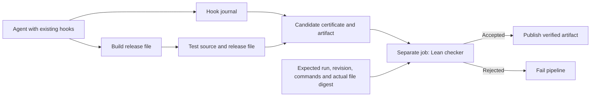

# Agent CI/CD with a Lean release gate

The pipeline runs a configured agent through the existing provenance hooks,
builds one release file, runs tests against that file, and exports a certificate.
A separate job builds the Lean checker from a fresh checkout, recomputes the
downloaded artifact's SHA-256, reconstructs the hook summary from the exported
journal, and checks the certificate against independently
configured expectations. Publication requires acceptance and another digest check.



## Run the supplied workflow

`.github/workflows/agent-ci.yml` runs a deterministic smoke test on pushes and pull
requests. `workflow_dispatch` also accepts agent, build, and test commands. The
default agent is explicitly a **host simulator**, not an LLM: it invokes the real
hook script around a file write. The example build creates a ZIP and the example
test opens that exact ZIP and checks its contents.

The three jobs are `agent`, `verify`, and `publish`. An accepted run uploads:

- `candidate-<run>-<attempt>`: release file, certificate, hook journal and collection metadata.
- `verification-<run>-<attempt>`: the independently supplied policy and verification report.
- `verified-release-<run>-<attempt>`: the accepted release file, certificate, and
  exported hook journal, sufficient for another consumer to rerun verification
  with its own policy.

Failed verification fails the workflow and skips publication. Hooks still fail
open in interactive use, but CI requires a nonempty recorded runtime trace. A
manual MCP session alone cannot satisfy that requirement.

The default delivery destination is GitHub Actions artifact storage. To deploy
to a registry, cloud service, or release page, add a job that needs `verify`,
requires `needs.verify.outputs.accepted == 'true'`, downloads the candidate from
the same run, and compares its bytes with
`needs.verify.outputs.artifact-sha256` before deploying. The existing `publish`
job is the complete digest-checking example. Give deployment credentials only
to that downstream job; its target and environment are consumer configuration.

## Use the actions in another repository

There are two composite actions, with Python 3.11+, Git, Bash and a POSIX runner
required. The verify action bootstraps elan 4.1.2 when needed and builds the pinned
Lean 4.28.1 checker. There are no mathlib or other Lean package dependencies.

| Action | Inputs | Outputs |
| --- | --- | --- |
| `actions/run` | `agent-command`, `build-command`, `test-command`; optional `workspace`, `run-id`, `base-revision`, `timeout-seconds` | `bundle` directory, still unverified |
| `actions/verify` | Downloaded `bundle`, independently configured copies of the three commands; optional `run-id`, `base-revision` | `accepted`, `artifact-sha256`, `report` |

Use `ketanbj/OpenAgentProvenance/actions/run@<reviewed-commit-sha>` and
`ketanbj/OpenAgentProvenance/actions/verify@<same-reviewed-commit-sha>` in separate
jobs. Replace the placeholder with the commit containing this implementation.
Transfer `bundle` with `actions/upload-artifact` and `actions/download-artifact`,
as in the supplied workflow. Pass the same command strings to both actions.

Defaults bind the certificate to `${{ github.run_id }}:${{ github.run_attempt }}`
and `${{ github.sha }}`. If checkout uses another revision, supply that independently
known full revision to **both** actions. For matrix runs, include the matrix
identity in `run-id` and artifact names. Rerun all dependent jobs together: an
old candidate from another attempt deliberately fails the current policy.

The commands run sequentially in the source checkout. Commands receive:

| Environment variable | Meaning |
| --- | --- |
| `OAP_ARTIFACT` | Fresh absolute path outside the checkout; build must write one regular file here and tests must examine it |
| `OAP_PLUGIN_ROOT` | Absolute plugin directory for enabling the existing host hooks |
| `OPENPROVENANCE_HOME` | Fresh per-run hook journal directory; do not override it |
| `OAP_ACTION_ROOT` | This action's repository root, available when using the composite action |

Commands are explicit workflow configuration and are executed by Bash with
`errexit` and `pipefail`. Each has a configurable timeout. Ordinary background
children in the command's process group are stopped before snapshots. Agent,
build, and test output is visible in Actions logs; the hook journal's payload
redaction does not redact process stdout.

## Connect a real agent

Install and authenticate your chosen host in the **agent job**, then configure
`agent-command` to launch it with this plugin enabled. The action runs an installed
host; it does not install a vendor CLI or provision credentials.

For Claude Code, the plugin directory can be supplied on the invocation:

```yaml
agent-command: >-
  claude --plugin-dir "$OAP_PLUGIN_ROOT" -p
  'Implement the requested change, run the relevant tools, and leave the changes uncommitted.'
```

Grant that host the repository/tool permissions required by your task through
its normal configuration. For Codex, use a runner image where the plugin is
installed and its hooks are enabled and trusted, then provide your normal
noninteractive command. The MCP-only fallback is insufficient because it cannot
observe other tools. Host setup instructions are in the main README; hook and
subagent coverage varies by host version.

Supply application-specific build and test commands. The build must leave the
source snapshot unchanged and write the deliverable to `OAP_ARTIFACT`. The test
command must leave both source and deliverable unchanged and return nonzero on
failure. An agent may change source files, but this policy requires HEAD to stay
at the expected base revision, so it should leave an uncommitted patch.

Install build/test dependencies before invoking the action. Generated caches and
other ignored files are outside the source digest; lockfiles should be tracked.
Package directories into a single archive before testing and publication.

## Local end-to-end smoke test

Run from this repository root. It clones the source into a disposable directory;
the example agent does not modify your working checkout.

```sh
bash scripts/setup_lean.sh
task_dir="$(mktemp -d)"
git clone --quiet --local . "$task_dir/source"
export OAP_ACTION_ROOT="$PWD"
export PYTHONPATH="$PWD/plugins/open-agent-provenance"
export OAP_AGENT_COMMAND='python3 "$OAP_ACTION_ROOT/examples/ci_agent.py"'
export OAP_BUILD_COMMAND='python3 "$OAP_ACTION_ROOT/examples/ci_build.py"'
export OAP_TEST_COMMAND='python3 "$OAP_ACTION_ROOT/examples/ci_test.py"'
base_revision="$(git -C "$task_dir/source" rev-parse HEAD)"

python3 -B -m oap.ci run \
  --workspace "$task_dir/source" --output "$task_dir/bundle" \
  --artifact "$task_dir/build/release.zip" \
  --run-id local:1 --base-revision "$base_revision"

python3 -B -m oap.ci verify \
  --bundle "$task_dir/bundle" \
  --checker "$PWD/formal/.lake/build/bin/provenance-checker" \
  --report "$task_dir/report" \
  --run-id local:1 --base-revision "$base_revision"
```

The final command reports `accepted: true`. Altering `bundle/artifact` and
verifying with a fresh `--report` directory must fail. You can also invoke the
compiled checker directly with `CERTIFICATE.json POLICY.json`. Exit codes are
0 for acceptance, 1 for policy rejection, and 2 for invalid arguments or JSON.
The policy file is supplied by the consumer, never copied from the candidate.

## What is proved

`formal/Provenance.lean` defines `Valid`, the release evidence specification,
and `check`, the executable Boolean checker. `check_iff` proves:

```text
check policy certificate = true ↔ Valid policy certificate
```

For `agent-release-v1`, acceptance requires:

1. Schema version 1; the expected run ID, base revision, and three command hashes.
2. Successful agent, build, and test exit codes.
3. Equal source digests before/after build and before/after tests.
4. The built, pre-test, post-test, and downloaded artifact digests all agree.
5. At least one hook-observed session and at least one recorded tool call.
6. Every exported session starts with a session-start observation and ends with
   a Stop or SessionEnd observation, with no recorded interruption.
7. Every recorded tool call has exactly one pre-event and exactly one terminal
   event, with status `succeeded`, `failed`, or `returned`.

A failed tool invocation can be recovered from; it remains recorded as failed.
Overall agent/build/test commands must still succeed. A missing terminal event
cannot be upgraded to success. Uncorrelated or contradictory terminal events
cause rejection. Observation arrival order within a completed call need not
equal execution order.

Additional theorems establish passing tests, the exact artifact binding,
build/test source agreement, complete calls, and rejection when the post-test
artifact differs from the consumer's digest. `Audit.lean` prints their axiom
dependencies. The proofs currently use only Lean's `propext` and `Quot.sound`;
there is no `sorry`, custom axiom, or `native_decide`. The bootstrap check fails
if the audited proofs depend on `sorryAx`.

`.github/workflows/formal.yml` builds these proofs and runs the Python integration
suite against the compiled checker. Tests also exercise the hook subprocess,
artifact substitution, stale source/test evidence, changed commands and run
identity, incomplete traces, malformed certificates, and nonzero exits.

## Exact trust boundary

This is a formally checked **release evidence policy**, not an authenticated
execution monitor or a full W3C PROV Constraints implementation.

- Python collects process exits, hashes files, verifies the local journal chain,
  and normalizes hook observations. Lean checks that normalized certificate.
  The independent verifier hashes the delivered file itself, rechecks exported
  journal chains, and requires the certificate's hook summary to match those
  rows. It rejects duplicate JSON keys and bounds each input JSON file to 8 MiB.
  Python, Git,
  filesystem observations, JSON decoding, SHA-256 collision resistance, Lean's
  kernel/runtime/compiler, and the CI environment remain trusted components.
- The source digest covers tracked and non-ignored untracked files, relative
  paths, deletions, and executable bits at snapshot boundaries. Symlinks,
  submodules, and special files are rejected. Git metadata, ignored files,
  external dependencies, network inputs, and changes made and reverted between
  snapshots are outside that digest's coverage.
- A passing test command is evidence of that command's exit code. The formal
  policy does not prove the tests are sufficient, that they really exercise the
  artifact, or that the artifact was causally built from every recorded input.
- Hooks and CI collection run under the same OS account as the agent. A malicious
  process can fabricate a journal or tamper with collection. A fresh verification
  job protects the checker from edits made in the agent job; it **does not**
  authenticate evidence produced by that job. Run IDs and journal heads are
  bindings, not signatures. Stronger adversarial guarantees require isolated
  observation and authenticated CI attestations.
- The supplied local-action workflow is a repository smoke test. A PR can modify
  that workflow or the checker source. A production consumer must pin the
  verification action to an independently reviewed commit and protect its policy
  and deployment workflow through its normal repository controls. Do not treat
  a successful PR-controlled workflow as independent release authorization.

References: [Lean proof validation](https://lean-lang.org/doc/reference/latest/ValidatingProofs/),
[GitHub composite actions](https://docs.github.com/en/actions/tutorials/create-actions/create-a-composite-action),
[GitHub workflow syntax](https://docs.github.com/en/actions/reference/workflows-and-actions/workflow-syntax).
